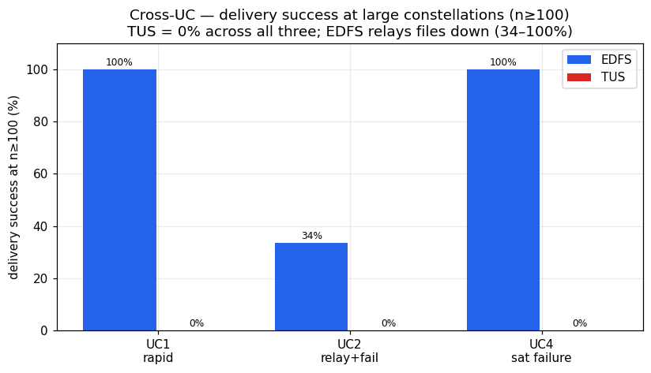

# EDFS vs TUS — Cross-UC Executive Summary

## Abstract

Across five use cases (UC1–UC5) the YASS satellite simulator compared EDFS (an IPFS/bitswap-based distributed store) against TUS (a resumable point-to-point upload modelling the current operational downlink standard) for delivering satellite imagery to ground assets (GA). The campaign establishes a single, consistent picture: EDFS buys resilience and favourable scaling — it relays content through surviving peers, survives producer failure, and delivers *faster* as the constellation grows — at a clear and quantifiable resource cost of roughly an order of magnitude more memory (~180–260 MiB vs ~13–15 MiB) plus much higher CPU and network transmit. TUS is functionally equivalent to EDFS only in the small, fault-free, direct-downlink regime, where it is dramatically lighter; it has no inter-satellite relay and therefore loses any file whose producer fails (UC4: 0/15 delivered) and produced 0% delivery at the largest rosters (n≥100) in UC1/UC2/UC4. The headline trade-off is robust, density-favouring delivery (EDFS) versus a minimal footprint with a single point of failure (TUS).

## 1. Verdict table

| UC | scenario | EDFS result | TUS result | who wins | key caveat |
|----|----------|-------------|------------|----------|------------|
| UC1 | Rapid Disaster Response — single photo to first GA, no faults | 100% delivery at every n/RF; latency ~790 s at small n, drops to 122–207 s at n=100–200 | 100% at n≤21 (~800 s, tied with EDFS); **TimedOut at n=100/200 (0%)** | EDFS at scale, tie at small n | TUS large-n failure confounded by shared-cluster infra pressure; priority unobservable |
| UC2 | Continuous LOS Relay — every sat one file, large-scale faults | 100% at n=1,2 and n=200 (RF=3); intermediate completeness partial & RF-dependent (n=100: 5%→46% as RF 3→5); first GA as fast as 9.6 s | 100% only at n≤8; 90% at n=21; **0% at n=100/200 (TimedOut)** | EDFS (resilience), with completeness caveats | TUS large-n failure confounded by infra; many EDFS resource rows are extraction gaps; some low/edge runs non-terminating |
| UC3 | Situation-Aware Routing — single large file, no faults | 100% delivery in all 18 variants; latency ~850 s at n≤21 → 234 s (n100) / 338 s (n200) | n/a (EDFS-only by design) | EDFS (no baseline) | priority unobservable; TX upper-bound only; partial GA-count rows at n200 |
| UC4 | Sat Failure over the pole — producer Destroyed before LOS | Delivers (100%) in the large majority of viable runs (n≥2, high/default); n100 first GA ~60 s; one anomaly `phigh-td45m-n02` (probable export gap) | **0 deliveries — all 15 variants TimedOut (0%)** | EDFS decisively | n01 (no peer) and plow non-delivery are by-design, not defects; 2 plow runs still Ongoing; priority unobservable |
| UC5 | General Failure — finite photo set, large-scale non-Destroy faults | All variants Success, every variant delivers ≥1 photo; first GA 14.3–569.6 s; **full-set completeness partial** (only n01 & n08 RF=1 reach 100%; n21 RF=1 = 15%) | n/a (EDFS-only by design) | EDFS (no baseline) | completeness RF-gated and noisy (n21: 15%→80%→50% as RF 1→3→5); small sample; priority unobservable |

## 2. Headline finding

The clearest, most decision-relevant result of the campaign is **resilience under producer failure (UC4)**: when a satellite captures a high-priority photo far over the pole and is then completely destroyed before reaching any ground station, **EDFS relays the photo around the dead producer through another satellite's content-addressed replica and delivers it (100% in the large majority of viable n≥2 configurations), while TUS — having no inter-satellite relay — delivers 0 out of 15 variants (every TUS run TimedOut at 0%).** This is the property TUS structurally cannot provide.

The second headline is **behaviour at scale**: at large rosters (n≥100) TUS reaches 0% delivery in UC1, UC2 and UC4, whereas EDFS continues to deliver — from 34% up to 100% depending on use case and replication — and, counter-intuitively, EDFS delivers *fastest* at the largest constellations (e.g. UC1 122 s at n=100, UC2 first GA 9.6 s, UC3 234 s at n=100, UC4 ~60 s at n=100), because a denser constellation provides more relay candidates that contact a ground station sooner. (The TUS large-n=100/200 failures are partly confounded by shared-cluster infrastructure pressure — see limitations.)

## 3. The cost

EDFS pays a consistent, quantifiable premium for content-addressing and bitswap relay, observed across all five use cases:

- **Memory:** EDFS peak RAM is ~180–260 MiB (range across UCs ~125–304 MiB) versus TUS ~13–15 MiB — i.e. roughly **13–15× more memory** (up to ~24× in individual UC1 points). EDFS memory is essentially constellation-size-independent (UC3: stable ~213–247 MiB), which helps capacity planning.
- **CPU:** TUS peak CPU stays at tens of millicores (~20–110 m). EDFS is far higher and scales with relay activity — hundreds of millicores at small n up to ~1950 m (UC1 n=200) and ~2730 m (UC2 n=100).
- **Network TX:** TUS TX is small and tracks the payload (e.g. ~134–135 MiB per 128 MB transfer). EDFS TX is much larger because bitswap floods blocks to many peers and grows with n and RF. **The absolute EDFS TX figures are an upper bound only** — inflated ~4.46× by a known mqtt2prom exporter-pod duplication — so the EDFS≫TUS comparison must be read qualitatively, not as exact ratios. Even after correcting the inflation, EDFS moves substantially more bytes than TUS.

In short: EDFS trades roughly an order of magnitude more RAM, several-fold more CPU, and far more network traffic for resilience and scaling that TUS cannot match.

## 4. Honest limitations of this dataset

These caveats bound every quantitative claim above and must accompany the deliverable:

a. **TX inflation (~4.46×).** All EDFS `tx_MiB` values are inflated by a mqtt2prom exporter-pod duplication and are reported as an upper bound; treat EDFS-vs-TUS bandwidth qualitatively only. TUS TX is unaffected.

b. **RX missing.** Network receive is unrecoverable (the world-controller ingress reads 0 on receivers); no RX metric is reported anywhere in the campaign.

c. **Metric-extraction gaps.** Many variants report `peak_mem_MiB=0`, `peak_cpu=0` and/or `mean_gs`/`n_gs=0` under large rosters / Prometheus pressure. These are extraction gaps, not genuine zero usage, and are excluded from resource and mean-latency statistics. (UC4's `phigh-td45m-n02` 0-delivery row, with all-zero metrics, is treated as a probable export gap, not a relay failure.) Delivery (`first_gs`) derived from GA-receipt events remains valid on such rows.

d. **Priority unobservable.** Across UC1–UC5, EDFS replicas are universally self-pinned and contention is negligible, so the priority axis (high/default/low) cannot be resolved; any apparent priority ordering is weak and noisy. No quantified priority-routing claim is made — UC3's situation-aware-routing objective in particular remains unproven and needs a dedicated contention experiment.

e. **TUS at scale confounded by infrastructure.** The TUS n=100/n=200 0% delivery in UC1/UC2 coincided with heavy shared-cluster infrastructure pressure. Protocol behaviour and infrastructure contention are confounded; an independent re-run on an uncontended cluster is required before attributing TUS's large-roster failure purely to the protocol. (UC4's TUS 0% is *not* so confounded — it is the expected, structural no-relay outcome.)

f. **Unsettled UC4 runs.** Two low-priority UC4 variants (`plow-td15m-n08`, `plow-td5m-n08`) were still Ongoing with partial export at the time of analysis; their final outcome is not settled.

g. **Small samples / noisy completeness.** UC5 completeness across RF is non-monotonic and noisy (n21: 15%→80%→50% as RF 1→3→5) at a small sample; higher-repetition re-runs would tighten the RF-vs-completeness relationship.

## 5. Guidance — when to prefer EDFS vs TUS

**Prefer EDFS when:**
- **Resilience matters** — producers or links may fail before reaching a ground station. EDFS recovers content from surviving replicas (UC4: delivers where TUS delivers nothing; UC2/UC5: keeps delivering under large-scale faults).
- **Inter-satellite relay is needed** — the producer is far from any ground station (over the pole) and must hand the file to a peer that downlinks it.
- **The constellation is large / dense** — EDFS exploits more relay candidates to deliver sooner and at scale, exactly where TUS reached 0% in this campaign.
- **A modest per-node memory/CPU budget (a few hundred MiB, hundreds–thousands of millicores) and elevated bandwidth are acceptable** in exchange for the above.

**Prefer TUS when:**
- **The footprint must be minimal** — TUS uses ~13–15 MiB RAM, tens of millicores, and payload-sized TX, roughly an order of magnitude lighter than EDFS on every resource axis.
- **The topology is a simple, reliable direct downlink** — small constellations with dependable producer-to-ground contact, no inter-satellite relay requirement, and no expectation of producer failure. In this regime TUS matched EDFS on latency (UC1: both ~790–807 s at small n) at a fraction of the cost.
- **No fault tolerance is required** — there is no benefit to paying EDFS's overhead when every file's producer is guaranteed to reach a ground station within its own contact window.

Net recommendation: adopt **EDFS as the resilient relay transport for the operational, fault-prone, large-constellation regime** that motivates this work, and retain **TUS as a light-footprint option only for small, reliable, direct-downlink deployments** — subject to closing the open items above (uncontended TUS-at-scale re-run, RX/TX instrumentation fixes, and a contention experiment to make priority observable).
