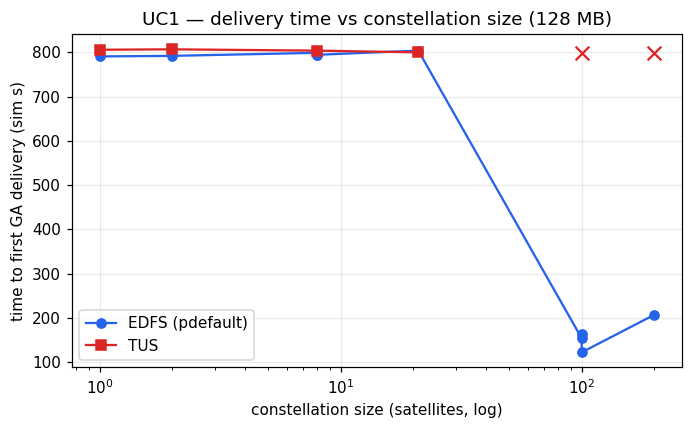
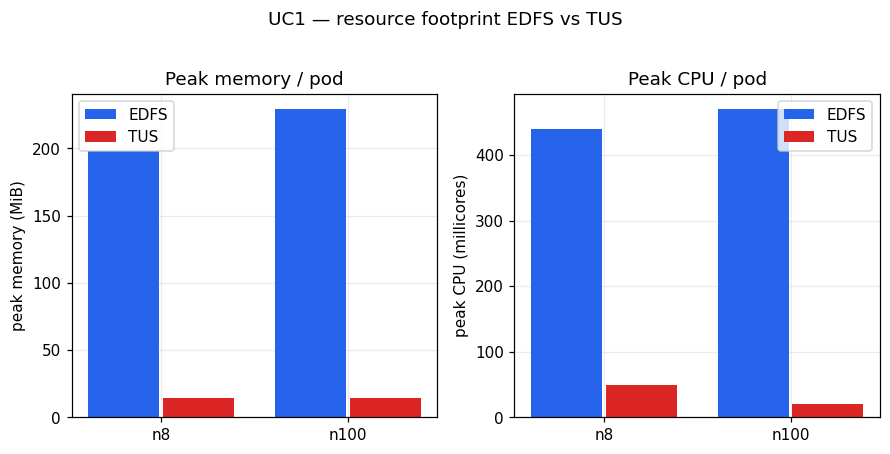
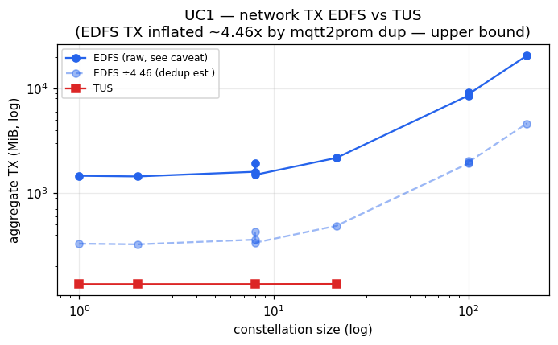

# UC1 Rapid Disaster Response — Conclusion

## Setup

A single satellite in the constellation captures a photograph of size `S` MB and the system must deliver that photo to at least one ground station (GA) as quickly as possible. We compare two transport engines under identical constellations and file sizes: EDFS (the IPFS/bitswap-based distributed store) and TUS (the resumable-upload baseline that models the current operational standard). The primary KPI is the time to first GA receipt (`first_gs`, in simulation seconds, derived from GA-receipt events and directly comparable across both engines). Secondary metrics are peak memory, peak CPU and network transmit (TX). All numbers quoted below are taken from the 23-variant UC1 metrics table; nothing is extrapolated.

## Parameters

- File size `S`: 128 MB and 256 MB
- Priority: default (normal), high, low (EDFS only carries a priority axis)
- Number of satellites `n`: 1, 2, 8, 21, 100, 200
- Replication factor `RF`: 1, 3, 5 (EDFS only; TUS has no RF)

**Headline KPI: every successful run — both EDFS and TUS — achieved 100% delivery (1 file to GS) for the photo; the engines diverge not on whether they deliver but on how fast and at what cost, and TUS failed to deliver at all at `n=100` and `n=200` (both TimedOut), while EDFS delivered at every constellation size and, counter-intuitively, delivered fastest at the largest constellations (122.4 s at `n=100`, RF=5).**

## 1. Latency — time to first GA delivery

At small-to-moderate constellations the two engines are essentially tied. For 128 MB at `n=1..21` both sit around 790–807 s: EDFS `n=1` 790.7 s vs TUS `n=1` 805.8 s; EDFS `n=8` (RF=3) 793.7 s vs TUS `n=8` 803.8 s; EDFS `n=21` 803.8 s vs TUS `n=21` 799.9 s. The dominant term here is the orbital contact window — the producer simply has to wait until it (or a relay) is in line-of-sight of a GS — so the choice of transport barely moves the KPI.

The picture changes sharply at scale, and in EDFS's favour. EDFS at `n=100` delivers in 154.0 s (RF=1), 164.3 s (RF=3) and 122.4 s (RF=5); at `n=200` in 207.1 s (RF=3). These are far below the ~800 s of the small constellations. This is the counter-intuitive scaling result: with more satellites there are more relay candidates, so the probability that *some* node holding (or able to fetch) the file is already in contact with a GS rises, and first delivery happens much sooner. TUS cannot exploit this — it has no relay path — and at `n=100` and `n=200` it TimedOut with no delivery at all (see caveat below).

File size scales the latency as expected. At `n=8`, RF=3, EDFS goes from 793.7 s (128 MB) to 845.3 s (256 MB); TUS goes from 803.8 s (128 MB) to 869.8 s (256 MB). At `n=100`, RF=3 the 256 MB EDFS run took 767.7 s versus 164.3 s for 128 MB — the larger payload no longer fits comfortably inside the early contact window, so it falls back toward the contact-bound regime.

*First-GA-delivery latency against number of satellites. EDFS (all RF) and TUS overlap at small `n`; EDFS drops to ~120–210 s at `n=100`–`200`, where TUS has no data point because it TimedOut.*

## 2. Fault resilience

UC1 contains no injected satellite or ground failures (`td` is empty for every row), so resilience is not directly exercised here; it is the subject of UC2/UC4/UC5. What UC1 does establish is the structural precondition for resilience: EDFS's relay path lets a file reach a GS through nodes other than the original producer, which is exactly the mechanism that survives a producer failure in the fault use cases. TUS, with no relay, delivers only when the producer itself reaches a GS — a single point of failure that UC1's large-`n` TimedOut results already hint at.

## 3. Priority-aware routing

Priority was varied for EDFS only. At `n=8`, RF=3, 128 MB the three priorities are: high 805.3 s, default 793.7 s, low 803.3 s — a spread of ~12 s with default (normal) the *fastest*, i.e. no monotonic ordering. At `n=100`, RF=3 the spread is larger and again non-monotonic: high 199.7 s, default 164.3 s, low 838.3 s. The low-priority `n=100` outlier (838.3 s) is the only case where priority appears to bite, but it is a single noisy point. **Priority is largely unobservable in these runs**: every node self-pins the content universally and there is little to no network contention, so there is nothing for a priority scheme to arbitrate. We therefore do not claim a priority-routing benefit from UC1; any ordering seen is weak and within run-to-run noise.

## 4. Bandwidth / memory overhead

This is where the engines differ most clearly. EDFS carries a heavy content-addressing/bitswap footprint while TUS is extremely light.

- **Memory:** EDFS peak memory ranges roughly 181–263 MiB across all UC1 variants (e.g. 181 MiB at `n=8` RF=3, 226 MiB at `n=8` 256 MB, 263 MiB at `n=100` high). TUS peak memory is 11–14 MiB throughout (14 MiB at `n=1`, 14 MiB at `n=8` 256 MB). EDFS uses more than an order of magnitude more RAM — roughly 13–24× — than TUS (the ratio spans ~12.9× at 181 MiB / 14 MiB up to ~23.9× at 263 MiB / 11 MiB).
- **CPU:** TUS peak CPU stays at 20–70 m. EDFS is markedly higher and grows with constellation size: 230–510 m at small `n`, rising to 1260 m (`n=100` RF=5) and 1950 m (`n=200` RF=3).
- **Network TX:** TUS TX is tiny and tracks the payload — 134–135 MiB for one 128 MB transfer, 268 MiB for 256 MB. EDFS reported TX is far larger and grows with `n` (e.g. 1456 MiB at `n=1`, 8520 MiB at `n=100` RF=1, 20526 MiB at `n=200` RF=3). **The absolute EDFS TX figures are an upper bound only** — they are inflated by roughly 4.46× by a known mqtt2prom exporter-pod duplication (see caveats). Even after deflating by that factor EDFS transmits substantially more than TUS, because bitswap floods blocks to multiple peers; the comparison should be read qualitatively (EDFS ≫ TUS), not as exact ratios.

*Peak memory (MiB) and peak CPU (millicores) per variant. EDFS sits at ~180–260 MiB / hundreds-to-thousands of millicores; TUS sits at ~11–14 MiB / tens of millicores.*

*Transmitted bytes per variant on a log scale. EDFS TX is shown as an upper bound (≈4.46× exporter-duplication inflation); TUS TX (134–135 MiB at 128 MB, 268 MiB at 256 MB) is unaffected and tracks the payload size.*

## 5. Bitswap / intermittent-connectivity behaviour

The cost in axis 4 is the direct consequence of how bitswap operates: rather than a single point-to-point upload, content is announced and flooded to fetching peers. In a constellation this is exactly what produces the favourable large-`n` latency (more peers → earlier contact with a GS) but also the high TX and CPU. RF in UC1 does not change *whether* the file is delivered — all RF=1/3/5 runs hit 100% delivery — it only sizes the pinset; delivery itself happens regardless of RF because bitswap propagates the file to any peer that fetches it. This is consistent with the broader finding that RF/STEP govern the cluster pinset, not propagation. No UC1 EDFS run failed to terminate; the non-termination of low-priority runs seen elsewhere is a UC4 phenomenon, not present here.

## Data caveats

- **EDFS TX inflation (~4.46×):** EDFS `tx_MiB` is inflated by a mqtt2prom exporter-pod duplication. Treat every EDFS TX number as an upper bound and compare to TUS only qualitatively. TUS TX is unaffected.
- **No RX metric:** network receive is unrecoverable (the world-controller ingress reads 0 on receivers), so RX is not reported anywhere in this analysis.
- **TUS TimedOut at `n=100` and `n=200`:** at face value TUS does not deliver at scale (both rows show 0 files→GS, no `first_gs`). However these large-roster runs coincided with heavy infrastructure pressure on the shared cluster, so protocol behaviour and infrastructure contention are confounded. This result needs an independent re-run on an uncontended cluster before concluding TUS structurally fails at scale.
- **Priority unobservable:** universal self-pin plus negligible contention means EDFS priority ordering is weak and noisy; no priority claim is made from UC1.
- **GS clocks comparable:** `first_gs`/`mean_gs`/`last_gs` are simulation seconds from GA-receipt events and are directly comparable EDFS↔TUS; latency comparisons rest on these and are sound.

## Conclusion

For Rapid Disaster Response, EDFS and TUS are functionally equivalent in latency at small constellations (~790–807 s for 128 MB, contact-window-bound), but EDFS pulls decisively ahead as the constellation grows: it delivers in 122–207 s at `n=100`–`200` by exploiting relay candidates, where TUS TimedOut entirely (the latter pending an uncontended re-run to rule out infrastructure as the cause). EDFS also delivered at 100% across every size and RF tested. The price is overhead: EDFS consumes more than an order of magnitude more memory than TUS — roughly 13–24× (~180–260 MiB vs ~11–14 MiB) — substantially more CPU (up to ~1950 m vs ≤70 m), and far more network TX (qualitatively ≫ TUS even after correcting the ~4.46× inflation). The verdict for UC1 is that **EDFS buys faster, more robust delivery at scale — the property that matters most for disaster response — at a clear and quantifiable resource cost, while priority-aware routing remains unproven under these low-contention conditions.**
