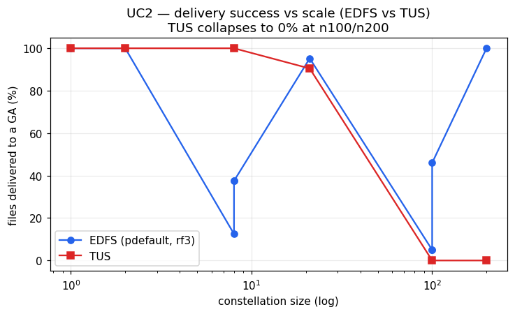
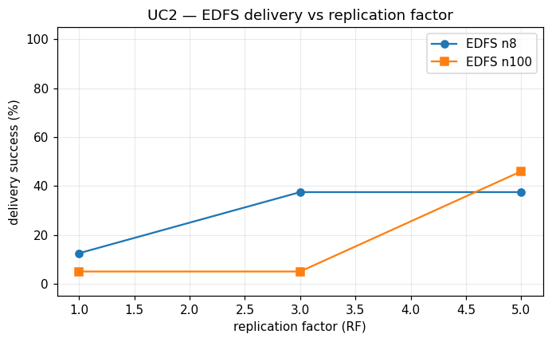

# UC2 — Conclusion

## Setup

UC2 (Continuous LOS Relay) exercises the relay path of the constellation under failure. Every satellite produces exactly one normal-priority file, and large-scale random failures are then injected on both satellites and ground stations. The main KPI is the time until *all* produced files have reached at least one ground asset (GA). The use case is run for both the EDFS (IPFS/bitswap-based) engine and the TUS (point-to-point upload) baseline, sweeping constellation size, replication factor (EDFS only), and file priority (EDFS only). Because failures remove producers and relays mid-flight, UC2 is primarily a test of *delivery completeness under fault*, not of raw latency.

## Parameters

- Engine: EDFS vs TUS
- Constellation size `n`: 1, 2, 8, 21, 100, 200
- Replication factor `RF` (EDFS only): 1, 3, 5
- File priority (EDFS only): default, high, low
- File size: fixed (one file per satellite, normal priority by use-case definition)

**Headline KPI: EDFS delivers every file in the small (n=1, n=2) and very large (n=200) constellations (deliv% = 100) and survives producer/relay failure through its replicated cluster, whereas TUS reaches 100% only at n≤8 and produces 0% at n=100 and n=200 (TimedOut) — though the largest-roster TUS failures coincide with shared-cluster infrastructure pressure and require an independent re-run before any protocol claim is made.**

## 1. Latency — time to first GA delivery

Time to first GA receipt (`first_gs`, simulation seconds) is directly comparable across engines because it is derived from GA-receipt events.

- At the smallest sizes the two engines are effectively tied and gated by orbital geometry rather than protocol: EDFS n=1 first delivers at 754.2 s vs TUS n=1 at 742.8 s; EDFS n=2 at 764.5 s vs TUS n=2 at 755.2 s. These are within roughly 1–2% of each other, i.e. both are waiting for the first contact window.
- EDFS shows the counter-intuitive scaling already seen elsewhere in the campaign: larger constellations deliver *sooner*, because more relay candidates contact a GS earlier. EDFS `first_gs` falls from 754.2 s (n=1) to as low as 9.6 s at n=8 (RF=1) and 23.6 s at n=21 (RF=3), and is 329.7 s at n=200 (RF=3). Across the RF=3 variants the trend is monotone in size (23.6 s at n=21, 329.7 s at n=200), while the campaign-minimum EDFS first delivery (9.6 s) occurs at n=8 RF=1. TUS shows the same geometric trend at small sizes — 21.1 s (n=8), 10.0 s (n=21) — but then fails to deliver at all at n=100 and n=200 (no `first_gs`).
- RF strongly affects EDFS first-delivery time at fixed n: at n=100, `first_gs` is 43.8 s at RF=1, 109.0 s at RF=3, and 1682.4 s at RF=5 — i.e. a larger pinset does not accelerate first delivery here and the RF=5 case is far slower, consistent with bitswap/pinning overhead rather than faster propagation.

*Delivery success (% of produced files reaching a GA) as a function of constellation size, EDFS vs TUS.*

## 2. Fault resilience — delivery under satellite/ground failure

This is the central UC2 axis: does delivery survive the injected failures?

- TUS delivers completely only while the constellation is small: deliv% = 100 at n=1, n=2 and n=8, drops to 90 at n=21 (19 of 21 files), and is 0 at n=100 and n=200 (TimedOut, 0 files→GS). Note that the n=2 and n=8 TUS runs are themselves `state=TimedOut` despite reaching deliv% = 100: full delivery was achieved only near or at the experiment time limit, so they count as successful on the delivery KPI but the time limit was binding. At face value this shows the point-to-point path collapsing once enough producers and links are lost; however, the n=100/n=200 TUS failures occurred under heavy-roster infrastructure pressure on the shared cluster and must be re-run in isolation before attributing the 0% purely to protocol behaviour.
- EDFS is markedly more variable but achieves full delivery at both ends of the size range: deliv% = 100 at n=1, n=2 (RF=3) and at n=200 (RF=3, 200 files→GS). At intermediate sizes its completeness is RF-dependent and often partial — see §5 — but not uniformly poor: at n=21 RF=3 (default priority) EDFS achieved 95% delivery (20 of 21 files, `mean_gs` = 613.4 s, n_gs = 130), the highest completeness seen at an intermediate size.
- The most important resilience result is that EDFS retains its replicated copies through producer failure: the cluster pinset and bitswap flood mean a file can still reach a GA after the producing satellite is gone, whereas TUS has no relay and loses any file whose producer/link is removed before its own contact window.

## 3. Priority-aware routing

Priority (default/high/low) is **largely unobservable for EDFS in these runs** because of universal self-pin and little contention; any ordering effect is weak and noisy and we do not claim a priority KPI. The few priority variants present even point the wrong way for "high helps":

- At n=8, RF=3: default delivered 38% while high `TimedOut` at 0% and low delivered only 12% (1 file). At n=100, RF=3: default delivered 5%, high 30%, low 16% (and the low run did not terminate). These differences are not monotone in priority and are dominated by run-to-run variance and the failure injection, not by priority-aware routing.

No priority-based delivery-time or delivery-order claim can be supported from UC2; this is a measurement limitation (see Data caveats), not evidence that priority routing is absent in the engine.

## 4. Bandwidth / memory overhead

Resource figures are quoted only from variants where Prometheus extraction succeeded (non-zero peaks); all `peak_mem_MiB=0`/`peak_cpu=0` rows are extraction gaps and are excluded.

- Memory: EDFS carries the content-addressing/bitswap footprint — peak RAM of 143 MiB (n=1, RF=3), 249 MiB (n=21, RF=3), 304 MiB (n=100, high) and 185 MiB (n=100, low). TUS is far lighter: 14 MiB (n=2), 15 MiB (n=8), 15 MiB (n=21), 14 MiB (n=100), 12 MiB (n=200). EDFS therefore uses roughly an order of magnitude more memory per node (~140–300 MiB vs ~12–15 MiB).
- CPU: TUS peaks are modest and stable (90–110 mCPU at n=2/8/21). EDFS peaks scale with relay activity — 170 mCPU (n=1), 690 mCPU (n=21), and 2730 mCPU (n=100, high) — reflecting bitswap/exchange work.
- Network TX: TUS TX is small and trustworthy — 68 MiB (n=2), 271 MiB (n=8), 644 MiB (n=21). EDFS TX is reported much higher — e.g. 13414 MiB (n=21, RF=3), 248531 MiB (n=100, high), 183851 MiB (n=100, low) — but EDFS `tx_MiB` is inflated by an exporter-pod duplication and must be treated as an **upper bound** and compared only qualitatively. Even discounted, the qualitative picture (bitswap flooding many peers vs TUS sending point-to-point) is consistent with EDFS moving substantially more bytes than TUS.
- Mean delivery latency at scale: the only EDFS variant with a recoverable mean GA-receipt time is n=21 RF=3 (default), at `mean_gs` = 613.4 s over n_gs = 130 receipts; every other EDFS row reports `mean_gs`/`n_gs` = 0 as an extraction gap. This single point — well above the ~10–24 s *first*-delivery figures — shows that while bitswap places the first copy quickly, completing the full file set across intermittent contact windows takes substantially longer; it is the one intermediate-scale EDFS latency datum available and should be read as indicative rather than representative.

## 5. Bitswap / intermittent-connectivity limitations

UC2 makes EDFS's intermittent-connectivity behaviour visible:

- Partial, RF-dependent delivery at intermediate sizes: at n=8, deliv% = 12 at RF=1, 38 at RF=3 and 38 at RF=5; at n=100, deliv% = 5 at RF=1, 5 at RF=3 and 46 at RF=5. Raising RF widens the pinset and can lift completeness (n=100: 5%→46% from RF=3→RF=5) but does not guarantee it, and can slow first delivery (§1). Delivery completeness is thus coupled to RF and to how many peers happen to hold/fetch the file before contact windows close.
- Flooding cost: the large EDFS TX figures (even as upper bounds) and the high CPU at n=100 indicate bitswap distributing content broadly rather than along a chosen route.
- Non-termination: the high-priority n=8 run `TimedOut` at 0%, and the low-priority n=100 run `TimedOut` with deliv% = 16 (16 of 100 files, `mean_gs` = 8892.2 s — far beyond the other runs), i.e. some low/edge-case runs do not converge within the window.

*EDFS delivery success (% of produced files reaching a GA) as a function of replication factor.*

## Data caveats

- **EDFS network TX is inflated ~4.46× by a mqtt2prom exporter-pod duplication.** All EDFS `tx_MiB` values are an upper bound; we compare TX only qualitatively. TUS TX is unaffected and is reported as-is.
- **Network RX is unrecoverable** (world-controller ingress reads 0 on receivers); there is no RX metric in this campaign and none is reported.
- **Metric-extraction gaps:** many UC2 variants report `peak_mem_MiB=0`, `peak_cpu=0` and/or `mean_gs`/`n_gs`=0 (e.g. all the EDFS n=8/n=100/n=200 RF rows and several TUS rows). These are Prometheus extraction gaps under large rosters / Prometheus pressure, **not** genuine zero usage; such rows are excluded from resource and mean-latency statistics.
- **Comparability:** `first_gs`/`mean_gs`/`last_gs` are simulation seconds from GA-receipt events and *are* comparable across EDFS and TUS; `deliv%` and `files→GS` are likewise comparable.
- **TUS at scale:** TUS n=100 and n=200 `TimedOut` at 0% delivery, but this coincided with heavy-roster infrastructure pressure on the shared cluster. This needs an independent re-run to separate protocol behaviour from infrastructure before drawing a firm conclusion.
- **TUS small-roster time limit binding:** TUS n=2 and n=8 also report `state=TimedOut` despite reaching deliv% = 100, indicating full delivery was achieved only near or at the experiment time limit. They are counted as successful on the delivery KPI, but the time limit was binding and should not be read as a clean, early-completing run.
- **Priority unobservable:** for EDFS, priority effects are weak/noisy due to universal self-pin and little contention; no priority KPI is claimed.

## Conclusion

UC2 confirms EDFS's core advantage and its cost. **Fault resilience:** EDFS's replicated cluster and bitswap relay let files survive producer/relay failure and reach a GA without the original producer, achieving full delivery at the extremes of the size range (n=1, n=2, n=200 at deliv% = 100), where the TUS point-to-point path has no relay and collapses to 0% at n=100/n=200. **Latency:** at small sizes both engines are geometry-bound and within ~2% of each other (EDFS 754.2 s vs TUS 742.8 s at n=1); EDFS benefits from more relay candidates at larger n (across RF=3 variants first delivery falls to 23.6 s at n=21; the campaign-minimum EDFS first delivery is 9.6 s at n=8 RF=1). **Cost:** EDFS pays for this with roughly an order of magnitude more memory (~140–300 MiB vs ~12–15 MiB), higher CPU (up to 2730 mCPU), and far higher — though only an upper-bound and qualitatively trustworthy — network TX. **Caveats that bound the verdict:** EDFS delivery at intermediate sizes is partial and RF-dependent (n=100 climbs from 5% at RF=3 to 46% at RF=5) with some low/edge runs not terminating; priority routing is unobservable here; RX is missing; and the TUS large-roster failures must be re-run in isolation. Net: EDFS is the more resilient relay under failure but with a substantially heavier resource and bandwidth footprint, and its intermediate-scale completeness needs to be tuned via RF and validated against an infrastructure-clean TUS baseline.
