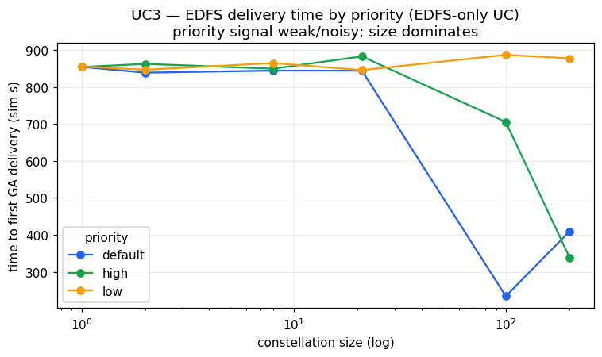

# UC3 — Conclusion

## Setup

UC3 (Situation-Aware / Priority-Aware Routing) exercises EDFS alone: a single large file is generated on one satellite, and the KPI is the simulation time until that file reaches at least one ground asset (GA). The sweep varies file priority (default / high / low) and constellation size (n = 1, 2, 8, 21, 100, 200) at a fixed replication factor RF = 3. This is an EDFS-only use case by design — there is no TUS baseline, because the objective is to characterise EDFS routing behaviour as the relay topology grows, not to compare protocols. All 18 variants reached the Success state with 100% delivery (1 file → GS in every run).

## Parameters

- Engine: EDFS only (no TUS baseline by design)
- Priority: default, high, low
- Constellation size n: 1, 2, 8, 21, 100, 200 satellites
- Replication factor RF: 3 (fixed)
- Files produced per run: 1 large file on a single producer satellite

**Headline KPI: EDFS delivered the file to a GA in 100% of all 18 variants; first-GA latency falls sharply at large constellations — from ~850 s at n ≤ 21 down to 234.0 s (default, n100) and 338.1 s (high, n200) — because more relay candidates reach a ground station sooner.**

## Latency — time to first GA delivery and scaling with constellation size

For the small and mid constellations the first-GA latency clusters tightly around 838–883 s regardless of size, which is consistent with the producer itself having to wait for its own line-of-sight contact window:

- default: 854.3 s (n01), 838.5 s (n02), 844.1 s (n08), 843.9 s (n21)
- high: 853.9 s (n01), 862.4 s (n02), 849.3 s (n08), 882.6 s (n21)
- low: 855.1 s (n01), 846.4 s (n02), 864.5 s (n08), 845.6 s (n21)

The counter-intuitive result appears at scale: larger constellations often deliver *faster*, not slower, because the file can be relayed by whichever of the many peers contacts a GS first rather than waiting for the producer's own pass. The clearest case is default priority at n100, where first-GA latency drops to **234.0 s** (mean 234.7 s, n_gs = 7) — roughly 3.6× faster than the n ≤ 21 cluster. The high-priority sweep shows the same trend at the largest size: **338.1 s at n200** versus 705.2 s at n100 and ~850–882 s at n ≤ 21. This confirms that EDFS bitswap relay turns constellation density into a latency advantage.

The trend is not perfectly monotonic across every row (e.g. low-priority n100 is 886.7 s, the slowest in its column, and default n200 is 409.5 s — slower than default n100), which is expected given that the timing depends on the specific orbital geometry sampled per run and on how quickly any single peer enters a contact window.

*First-GA delivery time (first_gs, s) versus number of satellites, separated by file priority. Note the large drops at n100 (default) and n200 (high), illustrating the more-relays-deliver-sooner effect.*

## Fault resilience

UC3 injects no satellite or ground-station failures (td is empty for all variants), so this run contributes no direct fault-resilience evidence; fault behaviour is the subject of UC2, UC4 and UC5. What UC3 does establish is the prerequisite for resilient relay: the file is content-addressed and reaches a GA even when the producer is not the node that makes the contact, which is the same mechanism that allows EDFS to survive a producer outage in the failure use cases.

## Priority-aware routing

Across the three priority sweeps the first-GA latencies overlap and do not separate cleanly. In the n ≤ 21 band all three priorities sit within roughly 838–890 s with no consistent ordering (e.g. at n08 high = 849.3 s is faster than default = 844.1 s only marginally and slower than nothing meaningful; at n21 default = 843.9 s is faster than both high = 882.6 s and low = 845.6 s). The large-n rows differ by priority (default n100 = 234.0 s, high n100 = 705.2 s, low n100 = 886.7 s; high n200 = 338.1 s, default n200 = 409.5 s, low n200 = 877.2 s), but this looks like per-run geometry/contact-window variance rather than a reproducible priority effect. **Priority is largely unobservable in these runs:** every node self-pins the content universally and there is little bandwidth contention, so the routing layer has no scarce resource to arbitrate by priority. No priority ordering should be claimed from UC3.

## Bandwidth / memory overhead

EDFS peak memory is stable and modest across the whole sweep, ranging from **213 MiB (low, n08) to 247 MiB (high, n200)**, with most variants near 218–234 MiB. This is the content-addressing / bitswap footprint (kubo + cluster), and it is essentially independent of constellation size — a useful property for capacity planning. Peak CPU varies more widely with activity, from 240 m (low, n01) to 1110 m (default, n100).

Network TX (tx_MiB) grows with constellation size as expected — from ~1.7–3.6 GiB at small/mid n up to 17 757 MiB (default n100), 19 677 MiB (high n100) and 39 338 MiB (high n200) — reflecting bitswap flooding the block to many fetching peers as the relay set grows. **These absolute TX figures must be treated as an upper bound only** (see Data caveats): the EDFS TX metric is inflated by an exporter duplication artefact, so the magnitudes are not trustworthy and TX should be read qualitatively (it scales up with n, as bitswap flooding predicts) rather than as exact bytes. There is no TUS baseline in this UC, so no protocol bandwidth comparison is possible here; the broader EDFS-vs-TUS memory contrast (EDFS ~180–260 MiB RAM versus TUS ~13–15 MiB) is established in the protocol-comparison use cases, not here.

## Bitswap / intermittent-connectivity limitations

UC3 highlights two structural properties of the bitswap transport. First, delivery latency at small n is gated by orbital contact windows, not by the protocol — the ~840–890 s floor reflects when a node can physically reach a GS. Second, the same flooding that makes large constellations deliver faster is what drives TX up steeply with n; the block is propagated to all fetching peers rather than to a tightly bounded RF-sized set, which is why TX climbs into the tens of GiB at n100/n200 while memory stays flat. RF = 3 sizes the cluster pinset but does not gate propagation. All UC3 variants nonetheless terminated successfully with 100% delivery.

## Data caveats

- **EDFS TX inflated ~4.46×.** tx_MiB for EDFS is inflated by an mqtt2prom exporter-pod duplication. Treat all EDFS TX numbers in this document (including 17 757, 19 677 and 39 338 MiB) as an UPPER BOUND; compare TX only qualitatively. TUS TX is unaffected, but UC3 has no TUS variants.
- **No RX metric.** Network RX is unrecoverable (the world-controller ingress reads 0 on receivers), so no RX figures are reported.
- **Latency metrics are comparable and trustworthy.** first_gs / mean_gs / last_gs are simulation seconds derived from GA-receipt events and are sound; they form the basis of the KPI here.
- **Partial GA-count rows.** Two rows have an incomplete ground-asset count: default n200 has n_gs = 0 and a blank mean_gs (the first_gs of 409.5 s is still valid), and high n200 / low n100 report n_gs = 5 and n_gs = 1 respectively. These reflect Prometheus GA-event extraction gaps under large rosters, not genuinely fewer deliveries — delivery still registered 100% in every case. Mean-GS statistics from these rows should be discounted accordingly.
- **Priority unobservable.** Universal self-pin plus negligible contention means file priority cannot be resolved in these runs; any apparent priority ordering is weak and noisy and is not claimed.
- **No TUS baseline by design.** UC3 is an EDFS-only use case; no EDFS-vs-TUS comparison is drawn from it.

## Conclusion

EDFS satisfies the UC3 KPI completely: every one of the 18 variants delivered the large file to at least one ground asset, with 100% delivery and the Success state throughout. The strongest finding is the favourable scaling behaviour — first-GA latency drops from a contact-window-limited ~850 s at small/mid constellations to 234.0 s (default, n100) and 338.1 s (high, n200) at scale, confirming that a denser relay constellation lets bitswap reach a ground station sooner. Memory overhead is stable and constellation-size-independent at ~213–247 MiB. The trade-off is bandwidth: TX rises steeply with n as bitswap floods the block to all fetching peers, though the exact magnitudes are not reportable given the TX inflation artefact. Priority-aware routing could not be demonstrated in this configuration because of universal self-pinning and the absence of contention, so a dedicated contention experiment is needed before any claim about priority ordering can be made. Overall, UC3 establishes EDFS as a robust, density-favouring relay transport for situation-aware delivery, with bandwidth cost and priority arbitration as the open questions.
