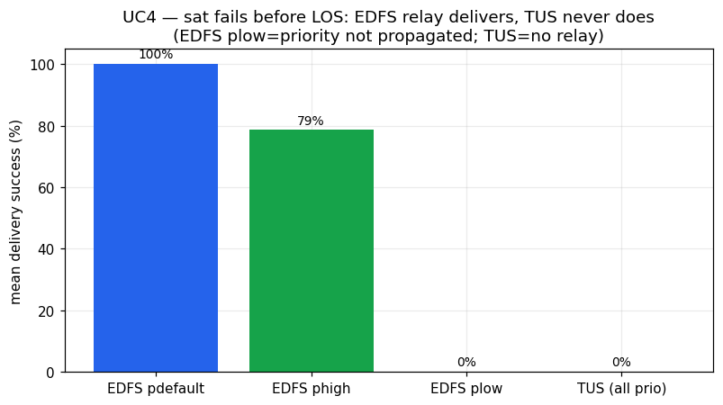
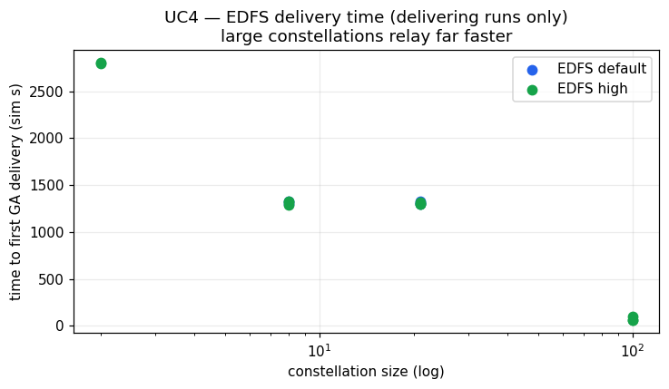

# UC4 — Conclusion

## Setup

UC4 (Sat Failure over the pole) tests fault resilience under a producer failure. A single satellite takes a HIGH-priority photo far from any ground station; before it reaches line-of-sight (LOS) with any ground station it suffers a complete failure (a `Destroy` event) after a configurable time-to-destroy `dt`. The key question is whether the photo still reaches a ground asset (GA) after the producer is gone: EDFS is expected to relay the file through other satellites' content-addressed replicas, whereas TUS — which has no inter-satellite relay — is expected to fail because the only copy dies with the producer. The sweep was run for both engines across constellation sizes `n ∈ {1, 2, 8, 21, 100}`, three destroy delays `dt ∈ {5m, 15m, 45m}`, and (for EDFS) file priorities `{high, default, low}`.

## Parameters

- Engines: EDFS vs TUS
- Number of satellites `n`: 1, 2, 8, 21, 100
- Time-to-destroy `dt`: 5m, 15m, 45m
- Priority (EDFS): high, default, low
- Replication factor (EDFS): RF = 3
- KPI: does the HIGH-priority photo reach at least one GA after the producer is destroyed; secondary: time to first GA delivery and resource/bandwidth footprint

**Headline KPI: EDFS survives the producer failure and delivers the photo (100% delivery) in the large majority of viable configurations — wherever at least one relay peer existed (`n ≥ 2`) and priority was `high`/`default`, with a single unexplained non-delivery at `phigh-td45m-n02` that most likely reflects an export gap — while TUS failed to deliver in 100% of variants (all 15 TUS runs TimedOut, 0% delivery), exactly as the use case predicts for a protocol without inter-satellite relay.**

## Fault resilience — delivery success under producer failure

This is the primary axis of UC4. The contrast is categorical:

- **TUS: 0 deliveries.** Every TUS variant — across all sizes `n01…n100` and all destroy delays `td5m/td15m/td45m` — ended in `TimedOut` with `files→GS = 0` and `deliv% = 0`. The single copy of the file is lost with the producing satellite, and there is no mechanism to recover it. This is the expected and correct behaviour for the TUS baseline.
- **EDFS: delivery survives the failure in the large majority of viable runs.** With more than one satellite and priority `high` or `default`, EDFS almost always reached `files→GS = 1` and `deliv% = 100`: e.g. `phigh-td5m-n02` (`first_gs = 2804.2 s`), `phigh-td15m-n02` (`2800.0 s`), `phigh-td15m-n08` (`1322.0 s`), `phigh-td5m-n21` (`1301.5 s`), `phigh-td45m-n100` (`101.1 s`), and the `default`-priority runs `pdefault-td15m-n21` (`1301.8 s`) and `pdefault-td45m-n08` (`1326.0 s`). The producer being destroyed did not prevent delivery, confirming that another satellite held a replica and relayed it to a GA.

The one viable but non-delivering EDFS run is treated as an exception, not a counter-example to the relay mechanism:

- **`phigh-td45m-n02` (probable export gap).** This row is `state = Success` yet reports `files→GS = 0`, `deliv% = 0` and `first_gs = —`, even though it is a `high`-priority run with a relay peer present (`n = 2`) — a configuration that delivered at both shorter destroy delays (`phigh-td5m-n02` and `phigh-td15m-n02` both delivered at ~2.8 ks). The same row also carries all-zero resource metrics (`peak_mem_MiB = 0`, `peak_cpu_m = 0`, `tx_MiB = 0`) with the note "no CPU/memory metrics (metrics-csv absent)", which is the signature of a metric/export anomaly rather than a genuine non-delivery. We therefore exclude this single variant from the "`n ≥ 2` delivers" claim and read it as a likely extraction gap; it is the only viable (`n ≥ 2`, non-`low`) variant that does not show delivery (`n-1` of `n` viable variants deliver).

The other non-delivering EDFS cases are not defects:

- **`n01` (single satellite).** `phigh-td15m-n01` and `phigh-td45m-n01` both `TimedOut` with 0 delivery. With only one satellite there is no peer to hold a replica; when the producer dies the file dies with it. This is an inherent limitation of the topology, not of EDFS.
- **`plow` (low priority).** All low-priority runs failed to deliver: `plow-td45m-n08`, `plow-td15m-n21`, `plow-td45m-n21` and `plow-td5m-n21` all `TimedOut` (0 delivery), and `plow-td15m-n08` and `plow-td5m-n08` are still `Ongoing` with partial export. Low-priority files are not propagated under the conditions of these runs (see the priority caveat below).

EDFS delivers (100%) for high/default priority once a relay peer exists (`n ≥ 2`) in all but one viable run; EDFS-low and all TUS variants do not deliver. The lone exception, `phigh-td45m-n02`, shows 0 delivery with all-zero metrics and is treated as a probable export gap.

## Latency — time to first GA delivery and scaling with constellation size

For the EDFS runs that delivered, the time-to-first-GA shows a strongly **non-monotonic, counter-intuitive scaling with constellation size**: larger constellations deliver *faster*, because more relay candidates raise the probability that some replica-holding satellite contacts a GS sooner.

- Smallest constellation, slowest: `phigh-td5m-n02` delivered at `first_gs = 2804.2 s` and `phigh-td15m-n02` at `2800.0 s` — the single relay peer must wait for its own LOS window.
- Mid sizes cluster around ~1300 s: e.g. `phigh-td5m-n21 = 1301.5 s`, `phigh-td15m-n08 = 1322.0 s`, `phigh-td45m-n08 = 1293.1 s`, `pdefault-td15m-n21 = 1301.8 s`.
- Largest constellation, fastest: `phigh-td15m-n100 = 62.3 s`, `phigh-td5m-n100 = 59.6 s`, `phigh-td45m-n100 = 101.1 s` — roughly **an order of magnitude faster than `n08/n21`** and ~45× faster than `n02`, because with 100 satellites a replica-holder is almost always already near a ground station.

The destroy delay `dt` had little systematic effect on `first_gs` within a given size (e.g. at `n08`: `td5m = 1330.2 s`, `td15m = 1322.0 s`, `td45m = 1293.1 s`), consistent with delivery being gated by orbital LOS geometry of the surviving relays rather than by exactly when the producer died. Because TUS delivered nothing, no latency comparison against TUS is possible — the comparison here is success-vs-failure, not faster-vs-slower.

EDFS first-GA latency for delivering runs: ~2.8 ks at `n02`, ~1.3 ks at `n08`/`n21`, and ~60–100 s at `n100`.

## Priority-aware routing

The data show one clear effect and one strong caveat:

- **Low priority does not deliver here.** None of the `plow` runs delivered (all `TimedOut` or still `Ongoing`), whereas the matched `phigh`/`default` runs at `n08`/`n21` delivered at 100%. Taken at face value this looks like a priority gate.
- **But priority is largely unobservable in these runs.** As documented for this campaign, EDFS replicas are universally self-pinned and there was little contention, so any apparent priority ordering is weak and noisy. The non-delivery of `plow` is better described as "low-priority files were not propagated under these conditions" — a by-design/limitation outcome — than as a measured priority-aware routing result. **We do not claim a quantified priority-ordering effect from UC4.** Note also that two `plow` runs (`plow-td15m-n08`, `plow-td5m-n08`) are `Ongoing` with only partial export, so their final state is not settled.

## Bandwidth / memory overhead — EDFS vs TUS

EDFS pays a substantial resource premium for content-addressing and bitswap, while TUS has a very light footprint. (Statistics below exclude rows with `peak_mem_MiB = 0` / `peak_cpu_m = 0`, which are Prometheus metric-extraction gaps under large rosters / Prometheus pressure, not genuine zero usage — see caveats.)

- **Memory.** EDFS peak RAM ranged ~125–190 MiB across runs with valid telemetry: e.g. `plow-td5m-n21 = 125 MiB`, `pdefault-td15m-n21 = 151 MiB`, `phigh-td5m-n100 = 182 MiB`, `phigh-td45m-n100 = 190 MiB`. TUS, where measured, used only `13–15 MiB` (`tus-td15m-n100 = 15 MiB`, `tus-td45m-n100 = 14 MiB`, `tus-td5m-n100 = 13 MiB`) — roughly **an order of magnitude lower** than EDFS.
- **CPU.** EDFS peak CPU reached up to `750 m` (`phigh-td45m-n100`), with `570 m` at `phigh-td5m-n100` and `390 m` at `pdefault-td15m-n21`; the measured TUS runs sat at ~`20 m`.
- **Network TX.** EDFS `tx_MiB` is large and variable (e.g. `821` at `pdefault-td15m-n21`, `2095–2159` across the `plow-n21` runs, `3237` at `phigh-td5m-n100`), but these absolute EDFS TX figures are an **upper bound only**, inflated ~4.46× by a mqtt2prom exporter-pod duplication; they may be compared only qualitatively. TUS TX is unaffected and is essentially negligible here (`tus-td15m-n100 = 3 MiB`; other TUS rows report 0 or are extraction gaps). Qualitatively, EDFS moves far more bytes than TUS to achieve relay delivery — the cost of replicating and flooding content to gain fault tolerance.

## Bitswap / intermittent-connectivity limitations

UC4 exposes the practical limits of the EDFS / bitswap relay model under intermittent space connectivity:

- **No peer, no recovery.** At `n01` there is no replica anywhere; the file cannot be recovered after the producer dies. Relay tolerance requires that a replica already exists on a surviving peer *before* the failure.
- **Latency is geometry-bound.** Even when delivery succeeds it can take a long time at small constellations (~2.8 ks at `n02`) because a single relay must wait for its own ground-station pass; resilience does not imply timeliness.
- **Low-priority / non-termination.** Low-priority runs did not deliver and two remain `Ongoing` — illustrating that propagation is not guaranteed for de-prioritised content and that some runs do not cleanly terminate.
- **Bandwidth cost.** The high EDFS TX (even discounting the ~4.46× exporter inflation) reflects content flooding to multiple peers, the overhead that buys the fault tolerance TUS lacks.

## Data caveats

- **EDFS network TX is an upper bound.** `tx_MiB` for EDFS is inflated ~4.46× by a mqtt2prom exporter-pod duplication; absolute EDFS TX values are reported as an upper bound and compared only qualitatively. TUS TX is unaffected.
- **No RX metric.** Network receive is unrecoverable (the world-controller ingress reads 0 on receivers); RX is therefore not reported anywhere in this conclusion.
- **Extraction gaps (zeros).** Many UC4 rows have `peak_mem_MiB = 0`, `peak_cpu_m = 0` and/or `mean_gs = 0` / `n_gs = 0` (e.g. several `pdefault`/`phigh` `n02`/`n08`/`n21` rows and all of the all-zero TUS rows). These are Prometheus metric-extraction gaps under large rosters / Prometheus pressure, **not** genuine zero usage; such rows are excluded from the resource and mean-latency statistics above. `first_gs` is still valid on those rows because it derives from GA-receipt events. One such row, `phigh-td45m-n02`, additionally shows `files→GS = 0` / `deliv% = 0` despite being a viable (`n ≥ 2`, `high`) configuration that delivered at shorter destroy delays; it is treated as a probable export gap and excluded from the "`n ≥ 2` delivers" claim.
- **GA-receipt clocks are comparable.** `first_gs` / `mean_gs` / `last_gs` are simulation seconds derived from GA-receipt events and are directly comparable across EDFS and TUS.
- **Priority unobservable.** Priority (high/default/low) is largely unobservable for EDFS in these runs (universal self-pin + little contention); no quantified priority-ordering claim is made.
- **By-design non-delivery.** EDFS `n01` (no relay peer) and `plow` (low priority not propagated) do not deliver by design/limitation, not because of a defect.
- **Ongoing runs.** `plow-td15m-n08` and `plow-td5m-n08` are still `Ongoing` (partial export); their final outcome is not settled.

## Conclusion

UC4 cleanly demonstrates the resilience advantage that motivates EDFS for space use. Under a complete producer failure before any ground contact, **TUS lost the file in 100% of cases (all 15 variants TimedOut, 0% delivery)**, while **EDFS recovered and delivered the HIGH/default-priority photo at 100% in the large majority of configurations that had a surviving relay peer (`n ≥ 2`) — all but one of the viable variants (`n-1` of `n`)**, with first-GA delivery as fast as ~60 s at `n100` thanks to the larger pool of relay candidates. The single exception, `phigh-td45m-n02`, reports 0 delivery alongside all-zero resource metrics and is treated as a probable export gap rather than a real relay failure, since the same `phigh-n02` configuration delivered at both shorter destroy delays. The advantage is real but not free: EDFS uses roughly an order of magnitude more memory than TUS (~125–190 MiB vs ~13–15 MiB) and far higher CPU and network traffic, it cannot recover anything when no peer holds a replica (`n01`), and low-priority content was not propagated in these runs. The headline verdict — EDFS relay survives producer failure where TUS cannot — is well supported by the data; the latency, priority and bandwidth observations should be read in light of the extraction gaps (including the `phigh-td45m-n02` anomaly), the TX inflation, the priority-unobservability caveat, and the two unfinished `plow` runs noted above.
