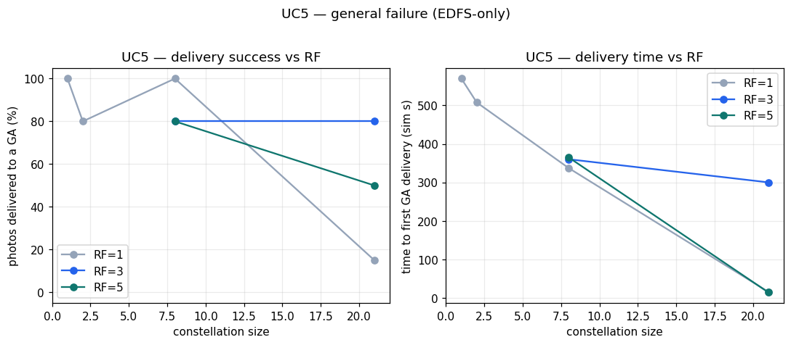

# UC5 General Failure — Conclusion

## Setup

UC5 stresses a satellite constellation in which a finite, countable set of photos is produced while large-scale faults (every hardware fault except the unrecoverable Destroy) are injected against both satellites and ground assets. The key performance indicator is the time until *every* produced photo has reached at least one ground asset (GA), i.e. full-set delivery under sustained, randomised failure. This use case is EDFS-only by design: it probes the distributed-storage engine's ability to keep replicating and relaying content while nodes drop out and recover, a regime in which a point-to-point upload protocol such as TUS has no comparable behaviour. Accordingly there is **no TUS baseline — EDFS-only UC by design**; the conclusions below characterise EDFS in absolute terms and against its own parameter sweep (constellation size n and replication factor RF), not against a second protocol.

## Parameters

- Constellation size n: 1, 2, 8, 21 satellites
- Replication factor RF: 1, 3, 5
- File priority: default (normal) only in these runs
- Fault regime: large-scale random satellite and ground-asset failures, excluding Destroy
- Engine: EDFS only

**Headline KPI: every UC5 variant reached the Success state and delivered at least one photo to a GA under sustained failure injection, with first-GA latency ranging from 14.3 s (n21, RF=5) to 569.6 s (n01, RF=1); however, full-set delivery (deliv%) was incomplete in most multi-satellite variants — only n01 and n08 (RF=1) reached 100% files→GS — confirming that EDFS keeps delivering through failures but that the per-photo completeness of the set is gated by RF and by transient connectivity rather than guaranteed.**

## Latency — time to first GA delivery and scaling with constellation size

First-GA latency (`first_gs`, simulation seconds) shows the same counter-intuitive size dependence observed across the other use cases: larger constellations tend to deliver *faster*, because more satellites mean more relay candidates and a shorter wait until some node enters line-of-sight with a ground asset.

- n01, RF=1: `first_gs` = 569.6 s (single satellite must itself reach a GA — slowest)
- n02, RF=1: `first_gs` = 507.6 s
- n08, RF=1: `first_gs` = 336.9 s
- n21, RF=1: `first_gs` = 15.7 s; n21, RF=5: `first_gs` = 14.3 s (fastest first contact)

The progression from 569.6 s at n01 down to ~15 s at n21 (RF=1) is a clean illustration of relay-candidate density shortening time-to-first-contact by more than an order of magnitude. Note that `first_gs` measures only the first photo's arrival; for n21, RF=1 the mean GA-receipt time `mean_gs` is just 64.4 s but only 15% of the set was delivered (see below), so a fast first delivery does not imply a fast *complete*-set delivery. Where full-set delivery did progress, `mean_gs` sat in the 475–503 s range (n08 RF=3/RF=5: 499.9 s / 503.1 s; n21 RF=3/RF=5: 475.8 s / 481.2 s).

## Fault resilience — delivery success under satellite/ground failure

This is the central axis for UC5. Under large-scale (non-Destroy) failure injection, EDFS never failed outright: all eight variants reached `Success` and every variant delivered at least one photo to a GA. The replication/relay mechanism therefore survives concurrent satellite and ground-asset failures — content that a failing producer had already shared into the swarm continued to propagate.

What failures *did* degrade was set *completeness* (`deliv%` / files→GS):

- n01, RF=1: 100% (1/1) — trivially complete with a single producer
- n08, RF=1: 100% (5/5) — full set delivered
- n02, RF=1: 80%; n08, RF=3: 80%; n08, RF=5: 80%; n21, RF=3: 80% (4/5 of the counted set for n21, RF=3; for n02 and the two n08 variants the table reports a deliv% of 80% against a single delivered file, so the underlying numerator/denominator is not exposed here)
- n21, RF=5: 50% (4/8)
- n21, RF=1: 15% (2/14) — the weakest completeness, despite the fastest first delivery

So resilience is qualified: EDFS reliably gets *something* to the ground under heavy failure, and with RF≥3 typically gets the large majority of the set down, but at the largest constellation with RF=1 (n21) the set was only 15% complete within the run. The pattern that raising RF on n21 lifts completeness from 15% (RF=1) toward 80% (RF=3) — at the cost of falling back to 50% at RF=5 — indicates that additional replicas help survive failures up to a point, but more replicas are not monotonically better here and the result is noisy at this sample size.

## Priority-aware routing

All UC5 runs used the default (normal) priority; there is no priority sweep to analyse. More fundamentally, file priority is largely **unobservable for EDFS in these runs**: universal self-pinning and the low level of contention in the simulated network mean that any priority-driven ordering is weak and noisy. No priority claim is made for UC5.

## Bandwidth / memory overhead

There is no TUS baseline to compare against. In absolute terms EDFS's resource footprint is consistent with the other use cases: a content-addressing/bitswap engine that is far heavier than a thin upload client would be.

- Peak memory (`peak_mem_MiB`): 159–236 MiB across the variants with valid extraction (n02: 159, n08 RF=5: 163, n08 RF=3: 166, n21 RF=5: 187, n01: 192, n21 RF=1: 196, n21 RF=3: 236). The highest footprint (236 MiB) coincides with the most-replicated mid-size case (n21, RF=3).
- Peak CPU (`peak_cpu_m`): 250–510 milli-cores, peaking at 510 m for n21, RF=3 — the variant with the highest observed CPU draw; n21, RF=5 also delivered 4 files at a higher replication factor but at a lower peak CPU (390 m).
- EDFS network TX (`tx_MiB`): grows strongly with both n and RF — from ~2000–2500 MiB (n01, RF=1: 2361; n02, RF=1: 2042; n08, RF=3: 2123; n08, RF=5: 2492) up to 9430 MiB (n21, RF=3) and 7032 MiB (n21, RF=5). Note that n08, RF=1 is excluded from this low-TX range because its `tx_MiB` reads 0 (a Prometheus extraction gap, not zero traffic), so the n08 figures above are for the RF=3 and RF=5 variants only. These TX figures are **inflated by roughly 4.46×** by a known mqtt2prom exporter-pod duplication and must be treated as an **upper bound**; they are useful only qualitatively (TX clearly rises with constellation size and replication) and absolute values should not be quoted as the real on-wire cost.

The cost picture is therefore: EDFS pays a substantial, RF-amplified bandwidth and a few-hundred-MiB memory price to obtain the fault-tolerant relay behaviour that this use case relies on.

## Bitswap / intermittent-connectivity limitations

The completeness results expose the limitation of bitswap-style propagation under intermittent connectivity. Because delivery depends on a fetching peer making contact while the content is reachable, full-set completion is not guaranteed within a bounded run: n21 RF=1 delivered only 2 of 14 counted files (15%) even though its first delivery was among the fastest. RF helps but inconsistently (n21: 15% → 80% → 50% as RF goes 1 → 3 → 5), reflecting both the RF-dependent size of the pin-set and the noise inherent in random failure injection at this scale. The qualitative TX growth (up to 9430 MiB at n21 RF=3) is consistent with flooding-style propagation, where the engine pushes content to many peers rather than along a single optimised path.

## Data caveats

- **EDFS-only, no second protocol.** UC5 has no TUS baseline by design; all comparisons here are internal (across n and RF), not cross-protocol.
- **TX is an upper bound.** `tx_MiB` for EDFS is inflated ~4.46× by a mqtt2prom exporter-pod duplication. Use it only qualitatively; do not cite absolute TX as real on-wire traffic. (RX is unrecoverable — world-controller ingress reads 0 on receivers — so no RX metric is reported at all.)
- **One metric-extraction gap.** Variant n08, RF=1 has `mean_gs` = —, `n_gs` = 0, `peak_mem_MiB` = 0 and `peak_cpu_m` = 0; these are Prometheus extraction gaps (not genuine zero usage), so that variant is excluded from the resource and `mean_gs` statistics above (its `first_gs` = 336.9 s and 100% completeness remain valid as they derive from GA-receipt events).
- **Priority unobservable.** EDFS priority effects are not observable here (universal self-pin, little contention); no priority ordering is claimed.
- **Small sample, random faults.** With at most three RF settings per size and randomised failure injection, the completeness figures (especially the non-monotonic n21 15%/80%/50% across RF) are noisy and should be read as trends, not precise rates. An independent re-run with more repetitions would tighten these.

UC5 — delivery completeness and GA-delivery time as a function of replication factor (EDFS only).

## Conclusion

Under sustained large-scale failure, EDFS demonstrates robust *availability*: every UC5 variant reached Success and delivered at least one photo to the ground, and first-GA latency improved dramatically with constellation size (569.6 s at n01 → ~15 s at n21, RF=1), confirming that a denser relay population shortens time-to-first-contact. Its weakness is *completeness* under failure and intermittent connectivity: only n01 and n08 (RF=1) achieved 100% of the photo set, while the largest roster at RF=1 (n21) reached only 15%, and raising RF improved but did not reliably maximise completeness (n21: 15% → 80% → 50% across RF 1/3/5). EDFS pays for this resilience with a heavy footprint — ~159–236 MiB peak RAM, up to 510 m peak CPU, and RF-amplified TX that is qualitatively large (nominally up to 9430 MiB at n21 RF=3, but an upper bound owing to the exporter duplication). The verdict for UC5: EDFS is well-suited to *getting content to the ground despite failures* and is the appropriate engine for this fault-heavy regime, but guaranteeing full-set delivery within a bounded time requires sufficient replication and an independent, higher-repetition re-run to firm up the RF-vs-completeness relationship.
